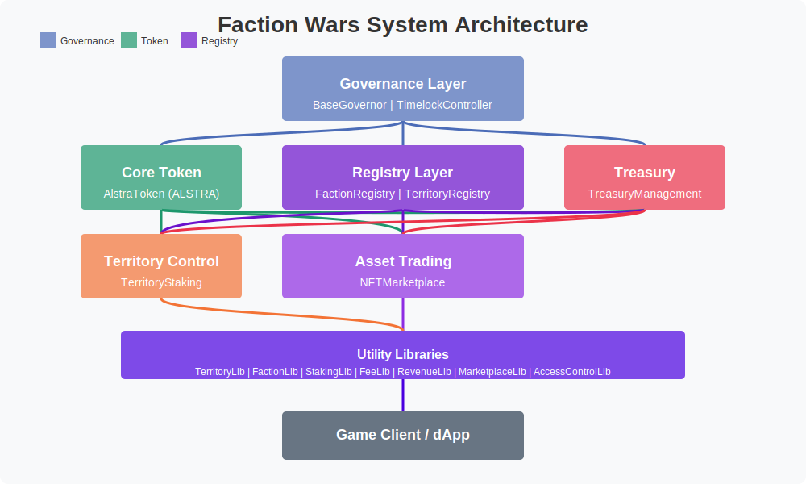

# Faction Wars

## Overview

Faction Wars is a Web3 application built on the AlstraNet blockchain platform that enables players to participate in a complex urban environment where law enforcement agencies, criminal syndicates, and vigilante groups compete for influence, resources, and territorial control. The game incorporates blockchain technology to provide true ownership of in-game assets as NFTs, participation in decentralized governance, and engagement with DeFi features for economic gameplay.

## Features

- **Faction-Based Gameplay**: Join one of three distinct factions—Law Enforcement, Criminal Syndicates, or Vigilantes—each with specialized features and interfaces
- **Territorial Control**: Stake tokens to influence or control different zones and earn rewards
- **NFT Marketplace**: Trade properties, vehicles, weapons, and equipment with faction-specific restrictions
- **DAO Governance**: Participate in decision-making for economic parameters, rules, and special events
- **DeFi Functionality**: Engage with lending, staking, escrow, and other financial services
- **Reputation System**: Build reputation within your faction to unlock roles and privileges
- **Economic Systems**: Participate in both legitimate markets and black market transactions 

## System Architecture

<p align="center">
  
</p>

The Faction Wars ecosystem consists of the following main components:

- **Core Token**: AlstraToken (ALSTRA) - The native token used for all economic activity
- **Registries**: FactionRegistry and TerritoryRegistry provide core game state data
- **Economic Mechanics**: TerritoryStaking, TreasuryManagement, and NFTMarketplace enable gameplay
- **Governance**: BaseGovernor and TimelockController for decentralized decision-making
- **Libraries**: Specialized libraries for staking, fees, territories, and more

## Prerequisites

- Node.js >=16.0.0
- Yarn or npm
- Git

## Installation

Clone the repository and install dependencies:

```bash
git clone https://github.com/cyberianinteractive/alstranet-contracts.git
cd alstranet-contracts
yarn install
```

Create a `.env` file in the root directory based on `.env.example`:

```
ALCHEMY_API_KEY=your_alchemy_api_key
PRIVATE_KEY=your_private_key
ETHERSCAN_API_KEY=your_etherscan_api_key
```

## Usage

### Compile contracts

```bash
yarn compile
```

### Run tests

```bash
yarn test
```

### Run a local blockchain node

```bash
yarn node
```

### Deploy contracts to a local network

```bash
yarn deploy
```

### Deploy contracts to a specific network

```bash
yarn deploy --network <network-name>
```

## Main Contracts

### Token Contracts

- **AlstraToken**: The native token of the ecosystem with fee burning mechanism and staking rewards
- **BaseGovernanceToken**: A base token with voting capabilities and role-based access control
- **BaseERC20Token**: A standard ERC20 token with additional features like pausability and burning

### Registry Contracts

- **FactionRegistry**: Manages faction membership, ranks, reputation, and roles
- **TerritoryRegistry**: Defines territory zones, properties, and faction control status

### Gameplay Contracts

- **TerritoryStaking**: Manages token staking for territory control and distributes rewards
- **TreasuryManagement**: Manages DAO funds, faction treasuries, and distribution of revenue
- **NFTMarketplace**: Handles trading of game assets with faction-specific features

### Governance Contracts

- **BaseGovernor**: Main governance contract for proposals, voting, and execution
- **TimelockController**: Controls execution delays for governance decisions

## Contract Interactions

The major contract interactions are:

1. **Territory Control Workflow**: Players stake ALSTRA tokens to gain control of territories 
2. **NFT Transaction Workflows**: Players trade game assets through the marketplace
3. **Revenue Distribution Workflows**: Game revenue is distributed to faction treasuries
4. **Governance Interaction Workflows**: Parameters are updated through proposal voting

## Development

### Project Structure

```
alstranet-contracts/
├── contracts/           # Solidity smart contracts
│   ├── base/            # Base contracts
│   ├── interfaces/      # Contract interfaces
│   ├── libraries/       # Utility libraries
│   └── protocol/        # Core protocol contracts
├── deploy/              # Deployment scripts
├── test/                # Test files
│   ├── fixtures/        # Test fixtures
│   ├── unit/            # Unit tests
│   └── integration/     # Integration tests
├── scripts/             # Utility scripts
├── tasks/               # Hardhat tasks
└── typechain/           # TypeScript typings (generated)
```

### Adding a New Contract

1. Add the contract to the appropriate directory in `contracts/`
2. Create an interface in `contracts/interfaces/`
3. Add tests in `test/unit/` and `test/integration/` if needed
4. Create a deployment script in `deploy/`

### Writing Tests

Tests are written using Mocha and Chai with Hardhat's testing utilities:

```typescript
import { expect } from "chai";
import { ethers } from "hardhat";
import { getContractWithSigner } from "../../common";
import { setupFixture } from "../../fixtures/your-fixture";

describe("YourContract", function () {
  let contract, admin, user;

  beforeEach(async function () {
    const fixture = await setupFixture();
    contract = fixture.contract;
    admin = fixture.admin;
    user = fixture.user;
  });

  it("should do something", async function () {
    // Test logic here
    expect(await contract.someFunction()).to.equal(expectedValue);
  });
});
```

## Deployment

The project uses hardhat-deploy for structured deployments. The deployment sequence is:

1. Deploy AlstraToken
2. Deploy Governance (TimelockController and BaseGovernor)
3. Deploy FactionRegistry
4. Deploy TerritoryRegistry
5. Deploy TerritoryStaking
6. Deploy TreasuryManagement
7. Deploy NFTMarketplace
8. Configure cross-contract references and permissions

To deploy to a specific network:

```bash
yarn deploy --network mainnet
```

### Deployment Verification

After deployment, verify your contracts on the blockchain explorer:

```bash
yarn verify --network mainnet
```

## Security Considerations

- All contracts implement Access Control for permissioned functions
- Reentrancy protection for all functions that transfer tokens or NFTs
- Circuit breakers for critical economic functions
- Fee calculation safeguards against manipulation
- Oracle manipulation prevention in auctions and pricing
- Front-running mitigations for marketplace operations

## Gas Optimization

The contracts implement several gas optimization techniques:

- Struct packing to minimize storage slots
- Efficient use of memory vs. storage
- Batch processing for common operations
- Caching of frequently accessed values
- Storage layout optimization

## Contributing

1. Fork the repository
2. Create a feature branch (`git checkout -b feature/amazing-feature`)
3. Commit your changes (`git commit -m 'Add some amazing feature'`)
4. Push to the branch (`git push origin feature/amazing-feature`)
5. Open a Pull Request

## License

This project is licensed under the MIT License - see the [LICENSE](LICENSE) file for details.

## Acknowledgements

- [OpenZeppelin Contracts](https://github.com/OpenZeppelin/openzeppelin-contracts)
- [Hardhat](https://hardhat.org)
- [hardhat-deploy](https://github.com/wighawag/hardhat-deploy)
- [AlstraNet Blockchain](https://alstranet.com)
